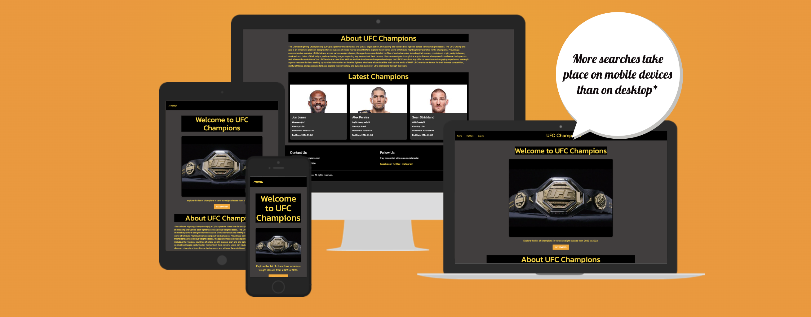
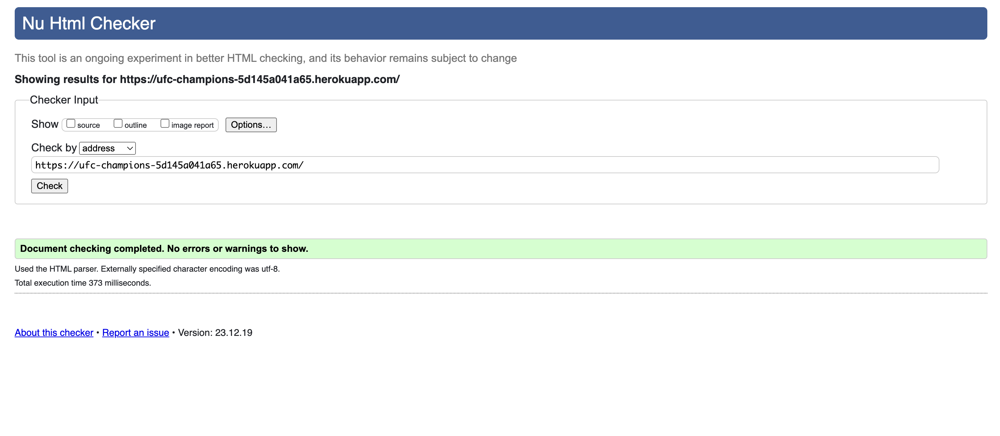

# UFC Champions 2022-2024

## Welcome

Welcome to UFC Champions Hub!
Discover the world of UFC like never before with our comprehensive Champions Hub. Our platform serves as the ultimate resource for UFC enthusiasts, providing a centralized space to explore, track, and engage with the champions who have left an indelible mark in the octagon. The primary aim of our application is to offer a user-friendly interface that seamlessly integrates a vast array of functionalities. Users can browse through a curated list of UFC champions, filter them by weight class, and stay up-to-date with their latest achievements. Whether you're a passionate fan or a dedicated follower of the sport, UFC Champions Hub caters to your needs, offering features such as champion addition, editing, and deletion. Our commitment to user security is reflected in robust authentication mechanisms, ensuring a safe and personalized experience. Join us on this exhilarating journey into the heart of UFC greatness – where every champion's story unfolds.

[View UFC Champions 2022-2024 on Github](https://github.com/Deesingh92/MSP-3-UFC-Champions)

[View the live website here](https://ufc-champions-5d145a041a65.herokuapp.com/)

- - -

- [UFC Champions]
  - [User Experience (UX)](#user-experience-ux)
    - [Initial Discussion](#initial-discussion)
      - [Key Information for the site](#key-information-for-the-site)
    - [User Stories](#user-stories)
      - [Client Goals](#client-goals)
      - [First Time Visitor Goals](#first-time-visitor-goals)
      - [Returning Visitor Goals](#returning-visitor-goals)
      - [Frequent Visitor Goals](#frequent-visitor-goals)
  - [Design](#design)
    - [Colour Scheme](#colour-scheme)
    - [Typography](#typography)
    - [Imagery](#imagery)
    - [Wireframes](#wireframes)
    - [Features](#features)
    - [Accessibility](#accessibility)
  - [Technologies Used](#technologies-used)
    - [Languages Used](#languages-used)
    - [Frameworks, Libraries \& Programs Used](#frameworks-libraries--programs-used)
  - [Deployment \& Local Development](#deployment--local-development)
    - [Deployment](#deployment)
    - [Local Development](#local-development)
      - [How to Fork](#how-to-fork)
      - [How to Clone](#how-to-clone)
  - [Testing](#testing)
  - [Credits](#credits)
    - [Code Used](#code-used)
    - [Content](#content)
    - [Media](#media)
    - [Acknowledgement](#acknowledgement)

## User Experience (UX)

### Initial Discussion

We laid the foundation for the UFC Champions Hub, an application designed to be the go-to platform for UFC enthusiasts. We focused on building a user-friendly interface that seamlessly integrates various functionalities to explore and engage with UFC champions. Our goal is to provide a centralized space for users to discover, track, and stay informed about the latest achievements of their favorite fighters. Through features like champion addition, editing, and deletion, we aim to make the platform dynamic and interactive. With a commitment to user security, we're dedicated to ensuring a safe and personalized experience for every fan of the octagon. The journey into the world of UFC greatness begins here, where passion meets innovation.

#### Features

  - Champion Database: Dive into a comprehensive database of UFC champions, featuring detailed profiles with information on nationality, weight class, and championship tenure.

  -  Dynamic Filtering: Easily sort and filter champions based on weight classes, allowing users to find their favorite fighters quickly.

   - User Authentication: Sign up, sign in, and manage user profiles for a personalized experience within the UFC Champions Hub.

   - Interactive UI: Enjoy an intuitive and visually engaging interface for seamless navigation and interaction.

   - Champion Management: Users can add, edit, or delete champions, contributing to the community-driven content of the platform.

   - Aesthetic Appeal: Champion profiles include visually striking images, enhancing the overall aesthetic of the app.

   - Community-Driven Content: Foster a sense of community by allowing users to actively participate in shaping and updating champion information.

   - Responsive Design: Access the app across various devices, ensuring a consistent and enjoyable experience on desktops, tablets, and smartphones.

   - User Notifications: Stay informed about new champions, updates, and community activities through user-friendly notifications.

This UFC Champions Hub aims to be the go-to platform for UFC fans, providing an interactive and centralized space to stay connected with their favorite fighters and actively contribute to the community's content.
#### Key Information for the site

Welcome to UFC Champions Hub, your go-to web application for diving deep into the world of UFC! This platform caters to UFC enthusiasts, providing an immersive and informative experience. With an intuitive and user-friendly design, users can explore a comprehensive database of UFC champions, featuring detailed profiles, fight records, and captivating images. The platform offers interactive features, including user accounts, favorites, and personalized data tracking, ensuring a tailored experience for every user. Whether you're a seasoned UFC fan or just starting to delve into the world of mixed martial arts, UFC Champions Hub offers an engaging and educational journey. Discover champions across weight classes, explore their achievements, and stay updated with the latest in the UFC world. Our fully responsive design guarantees a seamless experience on desktop, tablet, and mobile devices. Join us in celebrating the champions who have left an indelible mark on the UFC, and elevate your UFC experience with UFC Champions Hub 2022-2024. 

### User Stories

#### Client Goals

   - User Engagement: Our primary goal is to create an engaging and interactive platform for UFC enthusiasts, providing a captivating experience for fans and trivia lovers alike. We want users to immerse themselves in the world of UFC, explore champion profiles, and participate in the quiz to test their knowledge of the sport.

   - Comprehensive Fighter Profiles: We aim to offer detailed profiles of UFC champions, including their fight records, nationalities, and images. Users can delve into the backgrounds and accomplishments of their favorite fighters, enhancing their overall UFC experience.

   - Responsive Design: Ensuring a seamless user experience across different devices is a top priority. Our UFC app will be fully responsive, allowing users to access fighter information, explore events, and enjoy the quiz on desktops, tablets, and smartphones.

   - Intuitive User Interface: User-friendliness is key to our app's success. We strive to create an intuitive and easy-to-navigate interface, enabling users to effortlessly access fighter details, explore events, and engage with various features.

   - Visual Appeal: We understand the importance of visual appeal. Our app will feature eye-catching graphics, clean layouts, and vibrant imagery to enhance the overall design and provide users with an aesthetically pleasing experience.

   - Fighter Statistics: To cater to statistics enthusiasts, we plan to include detailed statistical information about each champion. This includes data on successful title defenses, knockouts, submission victories, and other key metrics.

   - Real-Time Updates: Keeping our content up-to-date is crucial. The app will receive regular updates with the latest UFC champion information, fight results, and event details to ensure users have access to the most current data.

   - Social Sharing: Encouraging users to share their favorite champions and engaging content on social media is a priority. We want our users to connect with fellow UFC fans, fostering a sense of community around the app.

   - Educational Content: Beyond fighter profiles, our app will include educational content about UFC history, trivia, and interesting facts. We aim to make the app a valuable resource for both seasoned fans and those new to the world of UFC.

   - Community Building: Our long-term vision involves building a vibrant community of UFC fans within the app. We want users to discuss fights, share insights, and connect with like-minded individuals, creating a thriving community of UFC enthusiasts.

#### First Time Visitor Goals

    Discover the UFC App:
        The primary goal for first-time visitors is to discover the UFC app and understand its purpose. They want to quickly identify that it's an application dedicated to UFC, providing comprehensive information about fighters, events, and quizzes related to the sport.

    Learn How to Explore Champions:
        New visitors seek clear instructions on how to explore UFC champions featured in the app. They want to understand how to navigate fighter profiles, access detailed information, and stay updated on the latest champions.

    Explore Interactive Fighter Profiles:
        Visitors are eager to explore the interactive fighter profiles within the app. They want to view champion details, including fight records, nationalities, and images, to gain a deeper understanding of their favorite fighters.

    Select a Fighter and Weight Class:
        Users intend to choose specific fighters and weight classes that interest them. They want to easily navigate through the app to find information about champions in different weight classes and select their preferred fighters.

    Enjoy the UFC Quiz Experience:
        Visitors want an enjoyable and challenging quiz experience tailored to UFC. They aim to test their knowledge of the sport, answer questions about fighters and events, and track their quiz scores within the app.

    Access Educational Content:
        Some visitors may be interested in accessing educational content related to UFC history, trivia, and interesting facts. They hope to find informative articles or fun tidbits that enhance their overall UFC experience.

    Connect on Social Media:
        New visitors who enjoy the UFC app may want to connect with it on social media platforms. They aim to follow the app for updates, engage with the UFC community, and stay informed about the latest in the world of UFC.

    Share Favorite Fighters:
        If they discover new favorite fighters, visitors may want to share these discoveries with friends on social media. They aim to showcase their passion for UFC and introduce others to notable fighters.

    Receive Support and Assistance:
        Visitors may need assistance or have questions while navigating the app. They hope to find clear contact or support information within the app if they encounter any issues or uncertainties.

    Leave Feedback:
        Some visitors may want to provide feedback or suggestions to improve the UFC app. They aim to find a way to share their thoughts with the app administrators and contribute to its enhancement.

    Explore Future Features:
        Curious users might be interested in any upcoming features or updates the UFC app plans to introduce. They aim to learn about the app's future offerings and stay excited about the evolving features.

    Access the App Responsively:
        Visitors expect the UFC app to work seamlessly on various devices, including desktop computers, tablets, and mobile phones. They want to have a responsive and user-friendly experience regardless of the device they use to access the app.

#### Returning Visitor Goals

    Continue Exploring UFC Champions:
        Returning visitors aim to pick up where they left off in exploring UFC champions. They want to continue browsing fighter profiles, checking for updates, and staying informed about the latest champions in the UFC app.

    Encounter New Fighter Information:
        Users who have previously engaged with the app are interested in discovering new information about their favorite fighters. They hope to find updated details, fight records, and any additional content related to the fighters they follow.

    Participate in UFC Community Discussions:
        Visitors who enjoy the UFC app may want to engage in community discussions or forums related to UFC events and fighters. They aim to connect with fellow fans, share insights, and discuss the latest happenings in the UFC world.

    Stay Updated on UFC Events:
        Returning visitors want to stay informed about any updates on UFC events, fight schedules, and championship bouts. They aim to access the latest information within the app and plan their UFC viewing experience accordingly.

    Refer Others to the UFC App:
        Satisfied users may refer the UFC app to friends and fellow UFC enthusiasts. They aim to expand the app's user base and contribute to building a community of passionate UFC fans.

    Connect on Social Media:
        Visitors who had a positive experience may want to connect with the UFC app on social media platforms. They aim to follow the app's social accounts for updates, behind-the-scenes content, and interactions with the UFC community.

    Provide Valuable Feedback:
        Returning users with valuable feedback or suggestions for improvement hope to find a channel within the app to share their insights with the administrators. They aim to contribute to the app's enhancement and user satisfaction.

   
    Enjoy a Seamless UFC Experience:
        Returning visitors expect the UFC app to provide a consistent and responsive experience across all devices. They want a seamless and user-friendly interface to continue enjoying the quiz and exploring UFC content effortlessly.

#### Frequent Visitor Goals

   - Stay Updated on Live Events:
        Frequent visitors aim to stay up-to-date with live UFC events, including fight nights, pay-per-view bouts, and other significant competitions. They want real-time information and notifications for upcoming events.

   - Access Exclusive Content:
        Dedicated users look forward to accessing exclusive content within the UFC app, such as behind-the-scenes footage, pre-fight interviews, and post-match analyses. They seek a comprehensive and immersive UFC experience.

   - Participate in Predictions and Polls:
        Frequent visitors may want to engage in predictions and polls related to UFC events. They aim to share their opinions, predict match outcomes, and see how their predictions compare with the broader UFC community.

   - Customize Fighter Profiles:
        Users who frequently interact with the app desire the ability to customize fighter profiles based on their preferences. They aim to personalize their experience by selecting favorite fighters, receiving tailored updates, and tracking specific divisions.

   - Join Exclusive UFC Communities:
        Dedicated UFC fans may seek access to exclusive communities or fan clubs within the app. They want to connect with like-minded individuals, share insights, and discuss UFC events in a community tailored to their interests.

   - Receive Personalized Recommendations:
        Frequent visitors expect personalized recommendations within the app, including suggested fighters to follow, recommended quizzes, and tailored content based on their UFC preferences and engagement history.

   - Participate in Live Chat during Events:
        Enthusiastic users may want to participate in live chat sessions or discussions during UFC events. They aim to share their reactions, discuss match moments, and connect with other fans in real-time.

   - Unlock Achievements and Rewards:
        Frequent users aspire to unlock achievements and receive rewards based on their participation, quiz scores, and overall engagement with the UFC app. They seek recognition for their dedication and knowledge.

   - Contribute User-Generated Content:
        Engaged users may want the opportunity to contribute user-generated content, such as fan art, fighter profiles, or unique UFC-related content. They aim to actively contribute to the app's community and content ecosystem.

   - Enjoy Seamless Live Streaming:
        Dedicated fans expect a seamless live streaming experience within the app for UFC events. They want high-quality video streaming, reliable connectivity, and an immersive viewing experience.

   - Access Enhanced Statistic Analytics:
        Frequent visitors with a keen interest in statistics seek enhanced analytics and insights related to UFC fighters, events, and match outcomes. They want detailed statistics and data visualizations to deepen their understanding of the sport.

   - Receive Early Access to UFC Merchandise:
        Engaged users may desire early access or exclusive offers on UFC merchandise available within the app. They aim to showcase their support for the fighters and the sport through branded merchandise.

Frequent visitors look forward to an enriched and personalized experience that goes beyond basic interactions, fostering a sense of community and appreciation for the UFC.

## Design

### Colour Scheme

    Dominant Colors:

        Black: Use black as the primary color to represent strength, sophistication, and the intensity of UFC competitions. It also serves as a solid background for other vibrant elements.

        Gold: As a primary color, gold signifies victory, excellence, and prestige. Use gold for significant highlights, championship elements, or premium features within the app.

        Orange: Orange brings energy, enthusiasm, and excitement. It's a dynamic color that aligns well with the intensity of UFC. Use orange for accents, buttons, and interactive elements to draw attention.

    Secondary Colors:

        White: Employ white for text, backgrounds, and certain UI elements. White provides a clean and modern look, enhancing readability and creating a visual balance with the dominant colors.

        Gray: Use various shades of gray for secondary elements, borders, or backgrounds. Gray adds depth to the design, creating a sense of hierarchy and ensuring that important components stand out.

    Optional Accent Colors:
        Gold: Consider incorporating gold accents sparingly to signify victory, championship, and excellence. Gold can be used for special highlights, achievements, or premium features within the app.

    Color Psychology:
        Black: Power, strength, sophistication.
        White: Cleanliness, simplicity, clarity.
        Gray: Balance, neutrality, professionalism.
        Gold: Victory, excellence, prestige.

### Typography

I used Google Fonts for the following font:

#### Afacad
  Font: Afacad, sans-serif
  Characteristics: Afacad provides a balance of simplicity and sophistication, making it an ideal choice for links. The sans-serif style enhances readability, and its modern aesthetic aligns seamlessly with the overall design theme of the UFC app.

Considerations:

  Consistency: Afacad is consistently used for links across the app, ensuring a uniform and recognizable look.

  Readability: The sans-serif style enhances readability on various devices, promoting a positive user experience.

This typography choice is intended to create a visually appealing and user-friendly interface for UFC app users. It also contributes to the overall brand identity, reinforcing the app's connection to the dynamic world of UFC

#### Rethink Sans

    Logo Font:
        Font: Rethink Sans
        Characteristics: Rethink Sans is a versatile and contemporary sans-serif font. Its clean lines and modern aesthetic make it well-suited for logo design. The font's simplicity ensures that the brand name is easily recognizable and stands out.

Considerations:

    Brand Identity: Rethink Sans reinforces the brand identity of the UFC app, providing a distinctive and memorable appearance for the logo.

    Versatility: The font's versatility allows for effective use in various contexts, maintaining clarity and impact.

This typography choice for the brand logo aims to create a strong and recognizable visual representation for the UFC app, contributing to a cohesive and impactful brand presence.

#### Kanit

  Font: Kanit
  Characteristics: Kanit is a contemporary and elegant sans-serif font. Its balanced and clean design provides a sophisticated look, enhancing the readability of content on the index page. The font brings a sense of modernity to the overall user interface.

Considerations:

    Readability: Kanit is chosen for its readability, ensuring that users can easily navigate and consume content on the index page.

    Modern Aesthetic: The font contributes to a modern and visually appealing design, aligning with the energetic and dynamic theme of the UFC app.

    Consistency: By using Kanit consistently on the index page, a cohesive and unified visual language is maintained throughout the app.

This typography choice for the index page aims to create an aesthetically pleasing and user-friendly experience, providing a balance between modernity and readability.

### Imagery

[Pexels](https://pexels.com/). Contents free images.
[ESPN](https://www.espn.com/mma/). Images for fighter profiles.

### Wireframes

Wireframes were created for mobile, tablet and desktop.

[Index Page - Desktop](ufc/static/images/wireframes/index-desktop.png) |
[Index Page - Tablet](ufc/static/images/wireframes/index-tablet.png) |
[Index Page - Mobile](ufc/static/images/wireframes/index-mobile.png)

[Fighters Page - Desktop](ufc/static/images/wireframes/fighters-desktop.png) |
[Fighters Page - Tablet](ufc/static/images/wireframes/fighters-tablet.png) |
[Fighters Page - Mobile](ufc/static/images/wireframes/fighters-mobile.png)

[Sign In Page - Desktop](ufc/static/images/wireframes/signin-desktop.png) |
[Sign In Page - Tablet](ufc/static/images/wireframes/signin-tablet.png)|
[Sign In Page - Mobile](ufc/static/images/wireframes/signin-mobile.png)

### Features
Features

    Champion Database: Access a comprehensive database of UFC champions, including detailed profiles, fight records, and images.

    Interactive Arena Map: Explore an interactive map showcasing iconic UFC arenas worldwide. Gain insights into each venue's history, capacity, and notable events.

    User Authentication: Create a personalized account to track your interactions with the app, save favorite champions, and participate in community discussions.

    Responsive Design: Enjoy a seamless experience across various devices, from desktops to tablets and smartphones.

    User Profile Customization: Personalize your user profile, set preferences, and track your quiz scores over time.

    Champion Addition and Editing: Contribute to the app by adding new champions or editing existing profiles. Keep the database up-to-date with the latest information.

    Social Sharing: Share your quiz results, favorite champions, or exciting arena discoveries on social media platforms. Connect with other UFC enthusiasts.

    Educational Content: Explore articles and fun facts about UFC history, fighters, and events. Enhance your knowledge while enjoying the app.

    Community Forums: Engage in discussions with other users, share insights, and stay connected with the UFC community.

    Dark Mode: Customize your app experience with a dark mode option for reduced eye strain in low-light environments.

    Search Functionality: Easily find specific champions, arenas, or quiz topics using the app's search feature.

    User Support: Access clear contact information or support channels for assistance, ensuring a smooth user experience.

These features collectively contribute to an immersive and dynamic UFC app, catering to both casual fans and dedicated enthusiasts of the sport.

*Info Area:*

The "Info" section acts as your guide to navigating the UFC Champions app efficiently. Begin by visiting the Home page, where you can explore an array of UFC champions. Dive into the details of each champion, from their fighting styles to career achievements. To contribute to the app's growth, consider adding new champions or editing existing profiles. If you're a new user, kickstart your journey by signing up and customizing your profile. For a quick search, utilize the search functionality to find specific champions or weight classes. The app is designed for UFC enthusiasts of all levels, providing an immersive experience in the world of ultimate fighting.

*Fighters Page:*

The Fighters page is your arena to explore the diverse world of UFC champions. Filter fighters based on weight classes to discover champions in your favorite categories. If you're interested in contributing to the app's content, consider adding a new champion or editing details of existing profiles. The page also allows you to edit or delete champions, ensuring the database remains accurate and up-to-date. Engage with the app by participating in discussions about your favorite fighters or discovering new talents. Whether you're a seasoned UFC fan or a newcomer to the sport, the Fighters page offers a comprehensive and interactive experience.

*Sign In Page:*

The Sign In page is your gateway to personalized interactions with the UFC Champions app. If you're a returning user, sign in to access your saved preferences, favorite champions, and quiz scores. For first-time visitors, the Sign In page provides an opportunity to create a new account. Enjoy the benefits of a personalized profile, track your engagement with the app, and join the UFC community. If you encounter any issues or need assistance, clear support information is available to ensure a seamless and enjoyable user experience. Sign in and immerse yourself in the dynamic world of UFC champions.

*404 Error Page:*

This 404 page provides a friendly and lighthearted approach to help users navigate back to the main website when they encounter a page that doesn't exist.

*Future Implementations:*

Future Implementations:

   - Expanded Fighter Categories: Broaden the app's scope by introducing more fighter categories, showcasing a diverse range of UFC fighters. Include niche and rising talents to provide users with a comprehensive exploration of the UFC roster.

   - Advanced User Profiles: Implement user accounts, enabling users to create personalized profiles. Users can track their favorite fighters, save preferences, and engage with a community of UFC enthusiasts. Foster friendly competition by incorporating features for score comparisons and achievements.

   - Weekly Challenges: Introduce weekly challenges or quizzes with specialized themes. Users can participate to earn badges, rewards, or unique achievements based on their knowledge of UFC fighters and events.

   - Live Rankings: Develop a live rankings feature, showcasing real-time updates on UFC fighter rankings. This dynamic feature allows users to stay current with the latest shifts in the UFC landscape.

   - Interactive Fight Predictions: Engage users with interactive fight prediction features. Users can make predictions for upcoming UFC events, share their insights, and compare their predictions with actual outcomes.

   - Virtual Fight Nights: Create a virtual fight night experience, allowing users to simulate and analyze hypothetical matchups between different fighters. This feature adds a layer of strategic and speculative engagement for users.

   - Community Tournaments: Organize community tournaments where users can compete against each other in predicting fight outcomes, trivia quizzes, or other UFC-related challenges. Fostering a sense of community and healthy competition is key.

   - Augmented Reality (AR) Fighter Showcases: Explore the integration of augmented reality to allow users to virtually place their favorite fighters in their surroundings, creating immersive and interactive showcases.

   - Mobile App Extension: Consider developing a dedicated mobile app to provide users with on-the-go access to UFC fighter information, quizzes, and interactive features. This enhances user convenience and expands the app's reach.

   - In-App Purchases: Explore monetization options such as in-app purchases for premium content, exclusive fighter profiles, or ad-free experiences to support the sustainability of the app.

   - Social Media Integration: Strengthen social media integration by enabling users to share their favorite fighters, achievements, and UFC insights directly on their social platforms, fostering a sense of community and engagement.

   - Accessibility Features: Prioritize accessibility improvements, ensuring that the app remains inclusive and user-friendly for individuals with diverse abilities.

   - Multilingual Support: Consider offering multilingual support to cater to a global user base, making UFC fighter information and quizzes accessible to a broader audience.

   - Feedback Mechanism: Implement a user-friendly feedback mechanism to gather suggestions, comments, and feature requests. Empower users to contribute to the ongoing enhancement and evolution of the UFC Champions app.

### Accessibility

    Focus States: Implement clear and visible focus states for interactive elements. Users navigating with a keyboard should easily identify which element is currently in focus, ensuring a smooth and intuitive experience.

    Screen Reader Compatibility: Ensure compatibility with screen readers by appropriately labeling and structuring app content. Use semantic HTML elements and provide alternative text for images and media, enhancing the experience for users with visual impairments.

    Color Contrast: Prioritize sufficient color contrast between text and background elements to enhance readability for users with visual impairments. Regularly test color combinations to meet accessibility guidelines.

    Alt Text for Images: Include descriptive alternative text (alt text) for all images, icons, and buttons. Alt text should convey the purpose or content of the image to users who rely on screen readers or cannot view images.

    ARIA Roles and Attributes: Use Accessible Rich Internet Applications (ARIA) roles and attributes to augment the accessibility of dynamic content and interactive elements, such as those within the UFC app.

    Captions and Transcripts: Provide closed captions for videos and transcripts for audio content to accommodate users with hearing impairments.

    Text Resizing: Enable easy text resizing without compromising content or functionality. Avoid fixed font sizes or layouts that may disrupt the user experience when text is enlarged.

    Testing with Assistive Technologies: Regularly conduct comprehensive testing with screen readers, keyboard navigation, and other assistive technologies to identify and address any potential accessibility issues within the UFC app.

    Semantic HTML: Utilize semantic HTML elements (e.g., 'nav', 'header', 'main', 'button') to logically structure the UFC app's content, aiding users in comprehending the organization of information.

    Skip to Content Link: Include a "Skip to Content" link at the beginning of the page, allowing users to bypass repetitive navigation and swiftly jump to the primary content of the UFC app.

    Error Handling: Ensure that error messages, such as incorrect quiz answers, are clear and provide guidance on rectifying the issue. Maintain a user-friendly approach to error communication.

    Consistent Layout: Uphold a consistent and predictable layout and navigation structure throughout the UFC app. Users should be able to anticipate the placement of elements for a more intuitive experience.

    Responsive Design: Guarantee that the UFC app is responsive, adapting seamlessly to different screen sizes and orientations. This ensures accessibility across a variety of devices.

    User Testing: Actively engage in user testing with individuals who have disabilities to gather valuable feedback and make continuous improvements based on real-world experiences.

## Technologies Used

### Languages Used

HTML, CSS, Javascript, Python and SQL were used to create this website.

### Frameworks, Libraries & Programs Used

- Balsamiq - Used to create wireframes.

- Git - For version control.

- Github - To save and store the files for the website.

- Pexels.com - used to download image artwork for website

- [My Color Space](https://mycolor.space/) - To choose the colours used for the website.

- [Font Awesome](https://fontawesome.com/) - For the iconography on the website.

- [Google Fonts](https://fonts.google.com/) - To import and use the fonts from the website.

- [Materialize](https://materializecss.com/) - Used Side Nav and custom classes, for responsive design.

- [Am I Responsive](https://ui.dev/amiresponsive?url=https://deesingh92.github.io/MSP2-SportsQuiz2023/) - To show the website on a range of devices.

- [Google Dev Tools] - To troubleshoot and test various features, and solve issues with responsiveness and styling.

- [Heroku](https://dashboard.heroku.com/apps/ufc-champions/deploy/github) - To deploy the live website.

- [Favicon](https://favicon.io/) - Used custom ufc favicon for website.

## Deployment & Local Development

### Deployment

Heroku was used to deploy the live website using these steps:
Step 1: Create a New Heroku App

    Login to Heroku:
    Login to your Heroku account on the Heroku Dashboard.

    Create New App:
    Click on the "New" button and select "Create new app." Choose a unique name for your app.

Step 2: Deploy Your Code

    Deploy Tab:
    In the Heroku Dashboard, go to the "Deploy" tab.

    Connect to GitHub:
    Under the "Deployment method" section, choose "GitHub" as your deployment method. Connect your GitHub repository to your Heroku app.

    Select Branch:
    Choose the branch you want to deploy from your GitHub repository.

    Deploy Branch:
    Click the "Deploy Branch" button to deploy your code to Heroku.

Step 3: Configure Your Environment

    Settings Tab:
    In the Heroku Dashboard, go to the "Settings" tab.

    Config Vars:
    Under the "Config Vars" section, add any environment variables your app needs.

Step 4: Open Your App

    Open App:
    Your app should be live now. Click the "Open App" button in the Heroku Dashboard to view your deployed website.

That's it! Your website should now be live on Heroku. Make sure to follow these steps whenever you want to update your code or make changes to the app. Adjust the steps if you are using a different hosting platform or deployment strategy.

### Local Development

## Testing
|Page|Device|Lighthouse Result|
|---|---|---|
|Index|Desktop||
|Index|Mobile||
|Fighters|Desktop||
|Fighters|Mobile||

### HTML

I used [W3 HTML Validator](https://validator.w3.org/) to validate all HTML files by URI, pasting each page into the address bar and checking to ensure no errors were found.

Home

Fighters

Filtered Recipes

Recipe Details

Categories

- - -

## Credits

### Code Used

- [Materialize](https://materializecss.com/sidenav.html) - Code used to implement a side nav bar when viewed on a mobile device, and also custom classes for responsivness on different devices.
  
- [DigitalOcean](https://www.digitalocean.com/community/tutorials/how-to-add-authentication-to-your-app-with-flask-login) - Used for logic for user authentication using Flask login.

### Acknowledgement

I would like to acknowledge the following people who helped and guided me in completing my second milestone project:

- Bristol College